# Bringing the WDL Workflow to AnVIL

## Find the Workflow on Dockstore

Navigate to the Workflows tab of your Workspace. Select "Find a Workflow". 

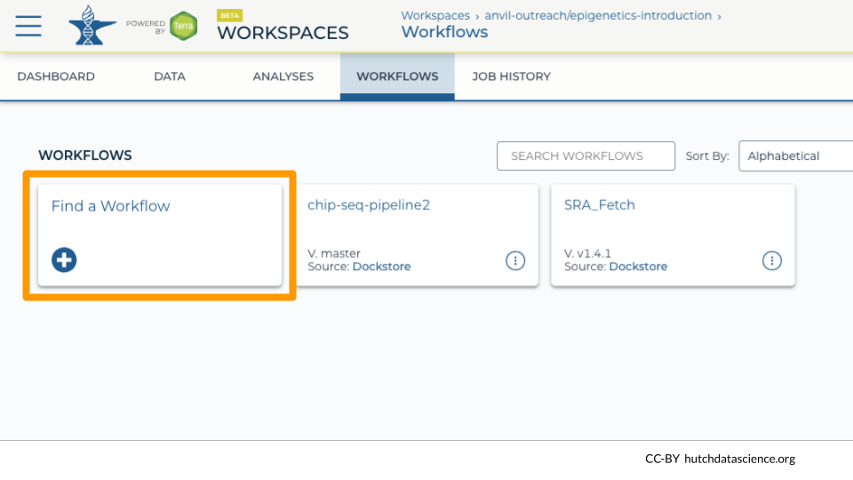

When the dialog box opens, select "Dockstore" on the bottom left. This will take you to the Dockstore search page.

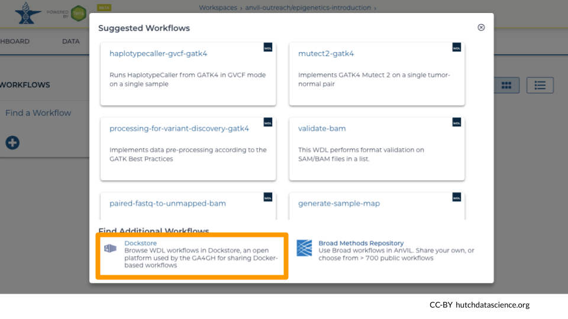

Enter fastq_subsample in the search box. Select the workflow "fhdsl/AnVIL_WDLs/fastq_subsample".

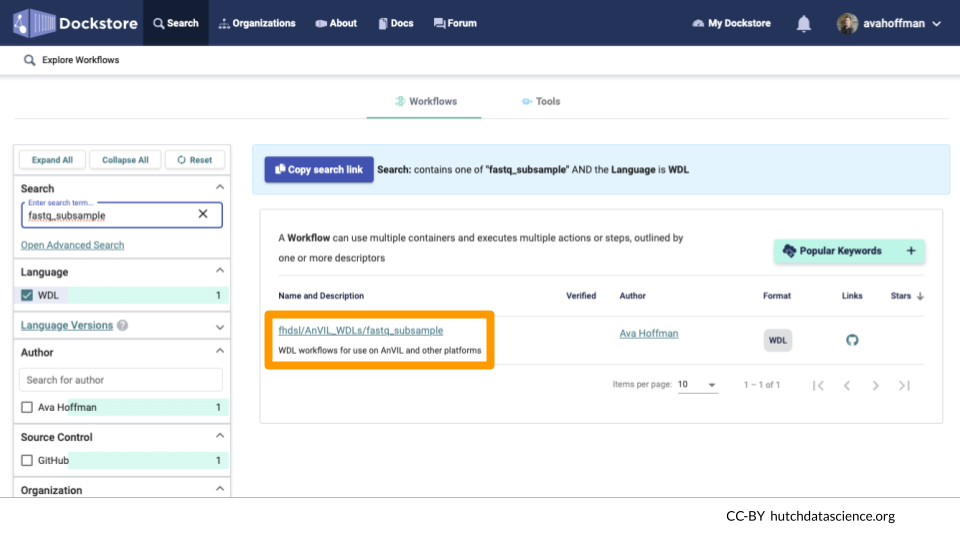

## Send the Workflow to AnVIL

On the right side "Launch with" menu, select "AnVIL". This will open a new tab.

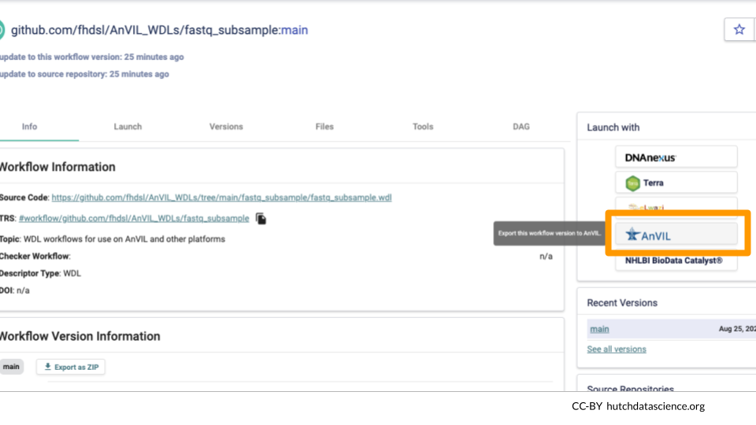

Select the appropriate Workspace where you want the workflow to appear. Select "IMPORT".

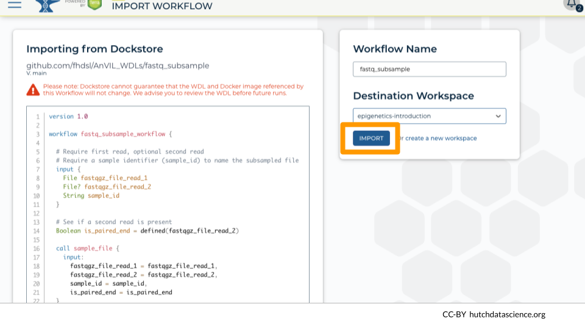

You should now be back on AnVIL!

# Set Up the Workflow

## Set Up Inputs

Use the "SELECT DATA" button to select the samples (rows) where you want to create fastq subsets. You can select all or some samples.

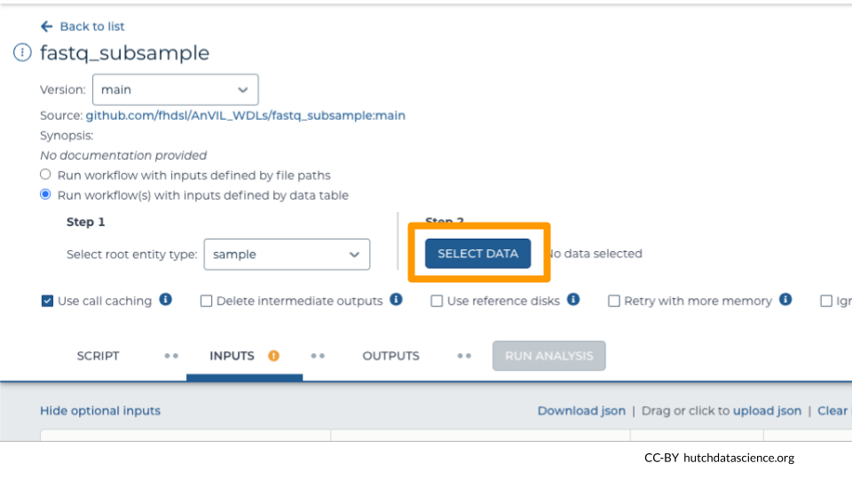

Columns of your "DATA" table are used as workflow inputs. You need to specify these. 

The first workflow input is a fastq or zipped fastq file. The workflow calls this input `fastqgz_file_read_1`. Under "Attribute" select the column that contains a link to the first set of reads. 

:::{.notice}
For single-end sequencing, the `fastqgz_file_read_1` input is the only file containing sequencing reads in your data.

For paired-end sequencing, the `fastqgz_file_read_1` input is the first of two read files.
:::

In this example, the column with the fastq file link is called "read1". It will look like "this.read1" under "Attribute".

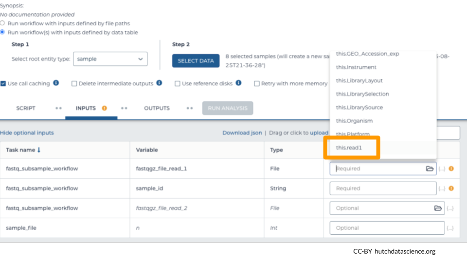

Select additional inputs. 

- **Required**: In this example, we've selected "sample_id" as the column containing the name of the sample. This helps with naming the file. 

- *Optional*: "read2" indicates the second set of reads in our paired-end sequencing approach. Skip this if you have single-end reads.

- *Optional*: Indicate how many reads you want in your subsample file. In this example, we wanted 20,000 reads. (Default: 10,000)

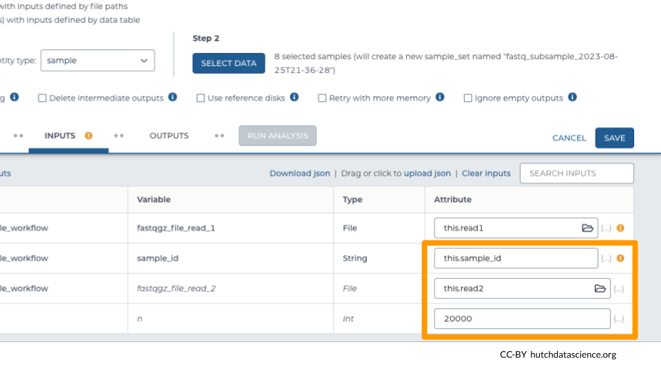

## Set Up Outputs

Workflow outputs are written to a Google Bucket when run on AnVIL. Setting up the workflow outputs allows us to create links to these outputs inside the DATA table in our Workspace, making them easier to locate. 

Select the "OUTPUTS" tab. Select "Use defaults" to use the default output column naming schema. 

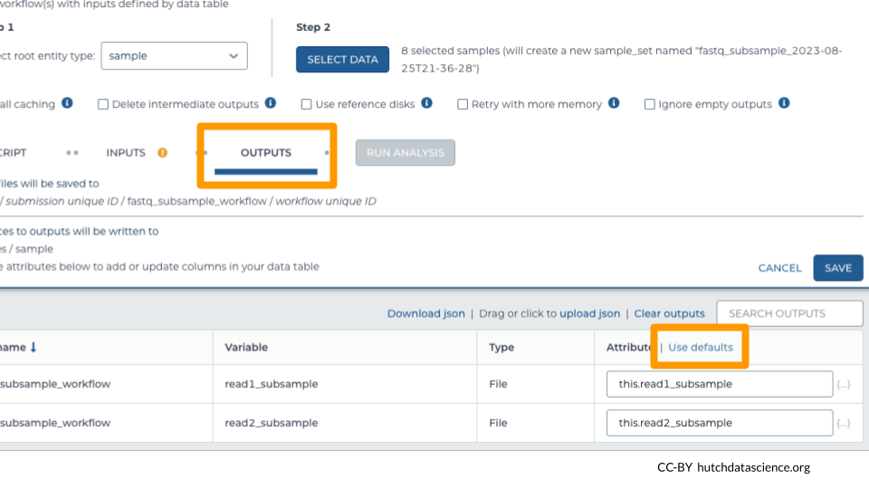

Click "SAVE".

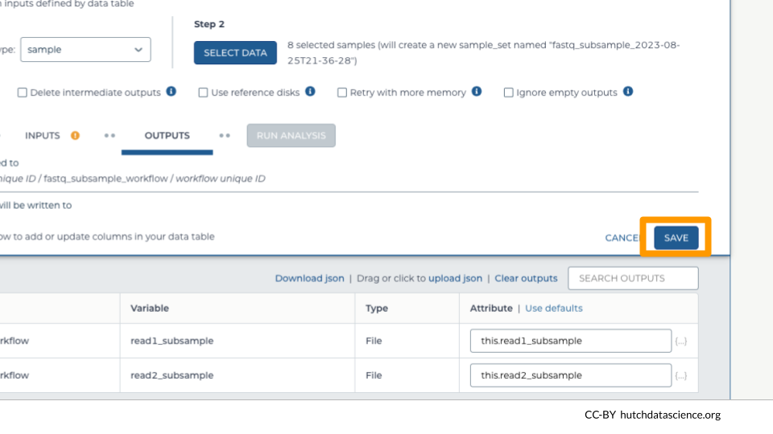

# Run the Workflow

## Start the Run

Once you have saved the inputs and outputs, you should be able to click on RUN ANALYSIS.

## Monitor the Run

Navigate to the JOB HISTORY tab. You should be able to select your most recent submissions in table form. Click on the most recent submission. Notice how each sample gets its own job, which keeps the whole process speedy!

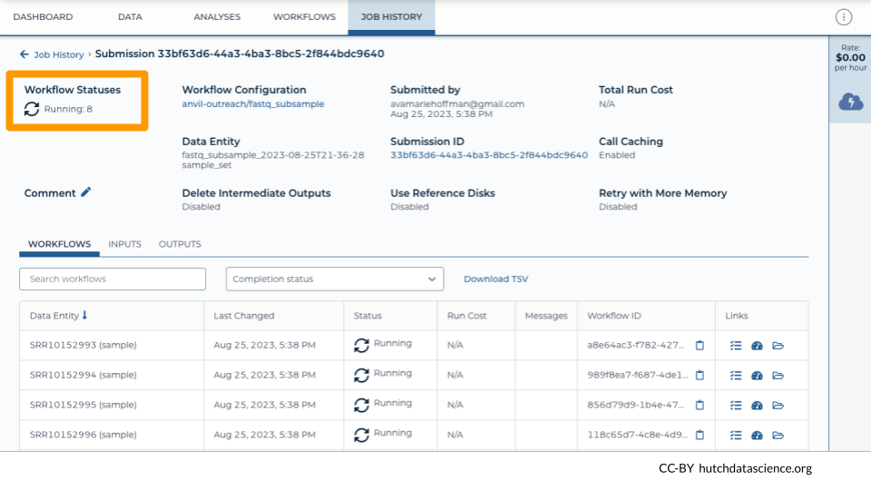

## Inspect the Run Results

Once the runs are completed, you should see the Status change to "Succeeded" if everything ran correctly.

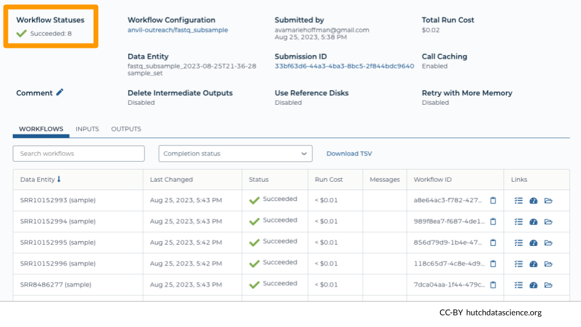

:::{.notice}
After 24 hours, you can also see the costs associated with each run under "Run Cost".
:::

## Inspecting Other Run Files

It can be helpful to look at intermediate files on Google Cloud Platform, especially if runs did not complete successfully. You can view these files by clicking on the folder icon for "Execution directory".

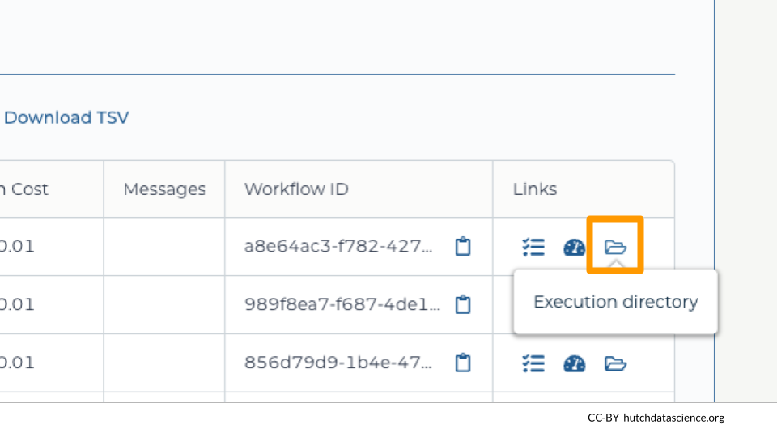

For each run, you can see a number of associated files, including the output `.fq` files and log files.

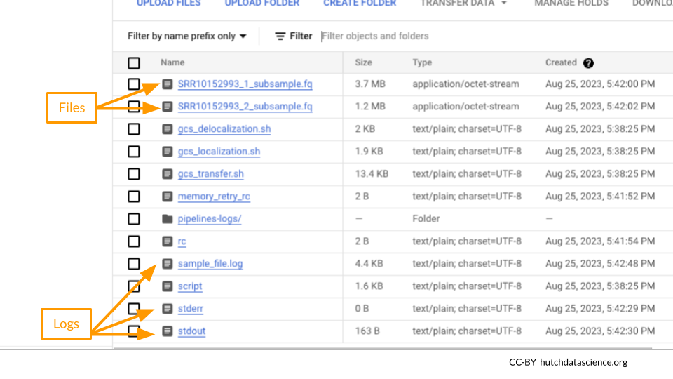

Click on `stdout` and/or `stderr` and "DOWNLOAD" to view the terminal output.

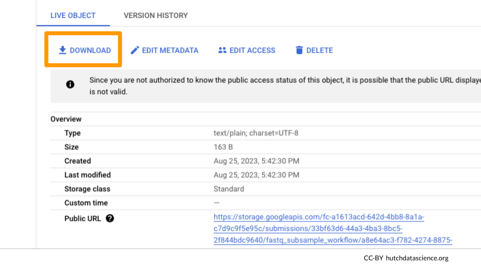

Here is what your output in `stdout` might look like.

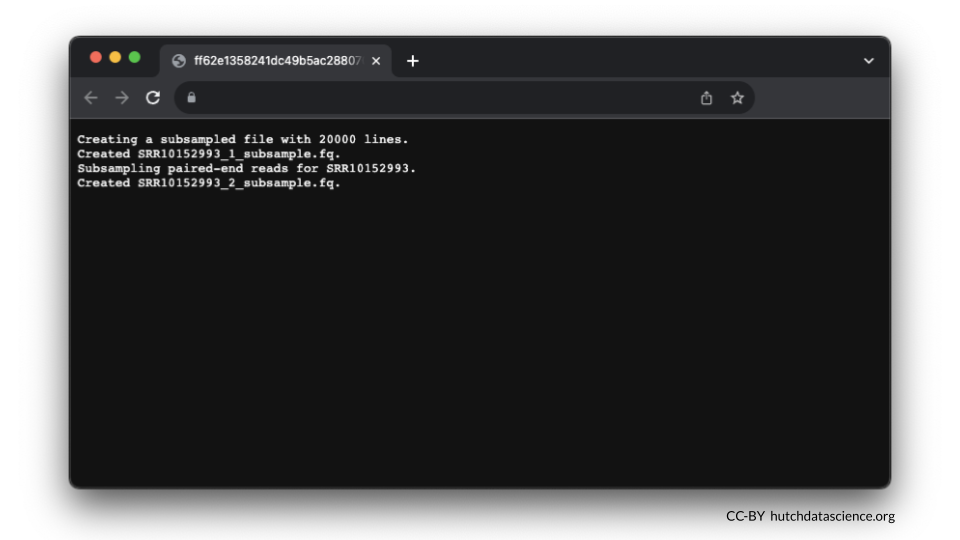

## Confirming Results in the DATA tab

We can see that the subsample files have been linked in the DATA table "sample".

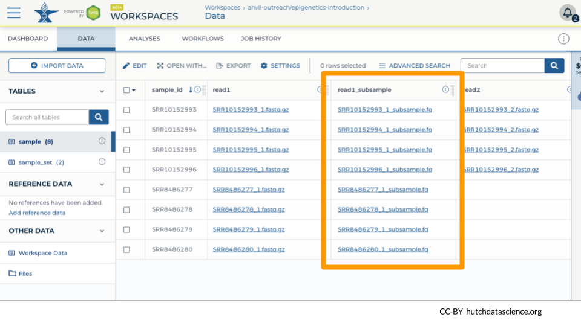

We had a mixture of single-end and paired-end reads, so only the paired-end samples get a second file.

